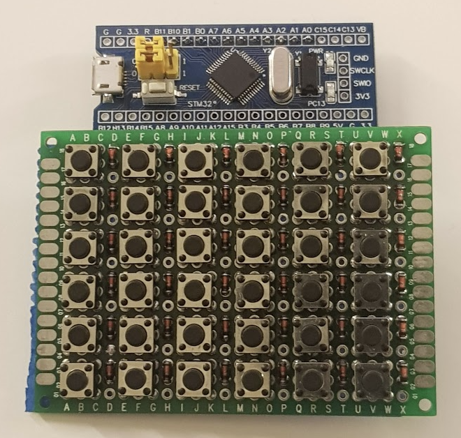

# stm32Launchpad
A 6x6 MIDI Launchpad based on STM32
## Overview
PluePill has direct USB connection, thus can play as a USB MIDI device.

There has been 2 methods I've considered to use:
- Based on GreatScott!'s Arduino based Launchpad project (YoutTube video [here](https://youtu.be/wyKStRyez5Y)), MIDI commands can be sent over serial line to computer. Then computer side needs a loopback software (e.g. [loopMIDI](https://www.tobias-erichsen.de/software/loopmidi.html)) to create a "virtual MIDI port" where can be then used by a Serial-MIDI Bridge (e.g. [Hairless-MIDISerial](https://projectgus.github.io/hairless-midiserial/)) to transmit MIDI signals.
- Direct USB MIDI

The 1st scenario does not work well for me as Serial-MIDI bridge software isn't compatible with my macOS (11.1 Big Sur) anymore. Plus, as BluePill already offers USB line natively, why not make it a USB MIDI device which won't require any driver when plugged in. Thus, I went ahead with the 2nd choice and it's being picked up by Garageband directly.

## Hardware

The Launchpad consists of
- 1 piece Generic BluePill (STM32F103C8T6)
- 1 piece 5x7cm prototype board
- 36 pairs of tactile switches and 1N4148 diodes (to cancel ghosting and masking, see details at section 8 [here](https://www.dribin.org/dave/keyboard/one_html/).)

## Pinout
**Column:** PA5, PA4, PA3, PA2, PA1, PA0

**Row:**    PA6, PA7, PB0, PB1, PB10, PB11

## Known issues at development
### IDE choices, PlatformIO or Arduino?
**PlatformIO** :x: uses official core [stm32duino](https://github.com/stm32duino/Arduino_Core_STM32), which is not compatible with [USBComposite for STM32F1](https://platformio.org/lib/show/2052/USBComposite%20for%20STM32F1) library yet, see [here](https://github.com/stm32duino/Arduino_Core_STM32/issues/687).

As a matter of fact, [USBComposite_stm32f1](https://github.com/arpruss/USBComposite_stm32f1) clearly mentioned in README section that it was based on a 3rd party core [Arduino_STM32](https://github.com/rogerclarkmelbourne/Arduino_STM32/).

**Arduino** :heavy_check_mark: works for me for now. Just follow the instructions of the [Arduino_STM32 core installation guide](https://github.com/rogerclarkmelbourne/Arduino_STM32/wiki/Installation) to setup the board. It comes with [USBComposite_stm32f1](https://github.com/arpruss/USBComposite_stm32f1) library where USBMIDI is already available.

### Matrix Keypad Library doesn't compile?

As the 36 buttom keypad only requires 12 pins connection if you set it as a matrix as GreatScott! suggested. But you will actually get error like this guy reported [here](https://github.com/rogerclarkmelbourne/Arduino_STM32/issues/603) when you are at compiling. Unfortunately, the answer from the author of [Arduino_STM32](https://github.com/rogerclarkmelbourne/Arduino_STM32/) mentioned that not all official libraries would work with it.

There has been a similar complaint [here](https://www.arduino.cn/thread-85287-1-1.html), but in Chinese. Good thing is, the same person that reported the issue also gave an solution later in the same thread: **Don't import Keypad library directly, but re-write it into your code.** And the code that's being shared helped me a lot.

### Pending improvement
I've realized that the keypad only registers 1 keyoress per time. Probably due to the *getKey* function in the end of the code. Hopefully [USBComposite for STM32F1](https://platformio.org/lib/show/2052/USBComposite%20for%20STM32F1) can be sooner ported to [stm32duino](https://github.com/stm32duino/Arduino_Core_STM32) so official Keypad library can be directly used.